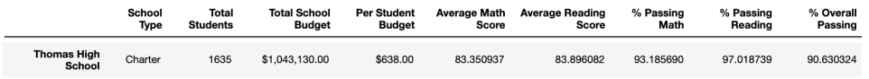
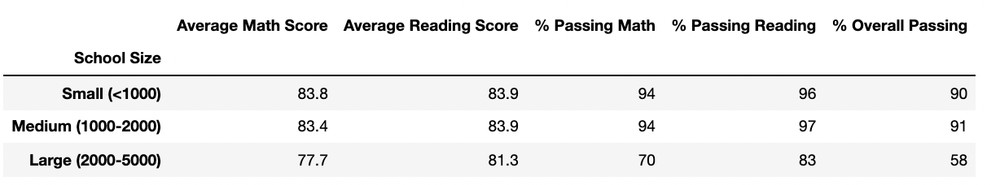
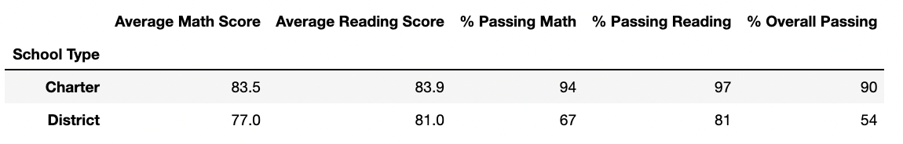

# PyCitySchools Analysis Using Pandas

## Overview of the School District Analysis 
Maria, the chief data scientist for a city school district is tasked with preparing all standardized test data for analysis, reporting and presentation to provide insights about performance trends and patterns. These insights are used to inform discussions and strategic decisions at the school and district level. 

Maria has reached out for help to analyze data on student funding and students' standardized test scores utilizing the [schools_complete](Resources/schools_complete.csv) and [student_complete](Resources/students_complete.csv) CSV files. 

The deliverables for the initial analysis are listed below:
* A high-level snapshot of the district's key metrics, presented in a table format
* An overview of the key metrics for each school, presented in a table format
* Top 5 and bottom 5 performing schools, based on the overall passing rate
* The average math score received by students in each grade level at each school
* The average reading score received by students in each grade level at each school
* School performance based on the budget per student
* School performance based on the school size 
School performance based on the type of school

To create the tables listed above, Jupyter Notebook, Pandas and Python were used. The initial school analysis can be be seen in the [PyCitySchools](PyCitySchools.ipynb) file. 

However, now the school board has notified Maria and her supervisor that the students_complete.csv file shows evidence of academic dishonesty; specifically, reading and math grades for Thomas High School ninth graders appear to have been altered.

Maria has reached out for help again to replace the math and reading scores for ninth graders at Thomas High School with NaNs while keeping the rest of the data intact. Once  the math and reading scores have been replaced, Maria requested the school district analysis be repeated with the updated data and to write a report describing how these changes affected the overall analysis.

The overall purpose of this analysis is to replace the ninth-grade reading and math schores for Thomas High School (THS) with NaNs and to repeat the school district analysis to observe how the change in the data has affected overall results, in comparison to the initial analysis. 

## Resources Used in the Analysis
- Data Source: [schools_complete](Resources/schools_complete.csv) and [student_complete](Resources/students_complete.csv)
- Software: Python 3.7, Jupyter Notebook
- Dependencies: Pandas, NumPy

## School Analysis Process 
To view the updated school analysis, please see the [PyCitySchools_Challenge](PyCitySchools_Challenge.ipynb) file

### Replacing Ninth-Grade Reading and Math Scores 
To replace the ninth grade reading and math scores for THS, I first importated NumPy module as a dependcy. 

I then used `.loc` on the student_data_df dataframe with conditional statements and logical operators to select the ninth grade reading scores and math scores for THS. 

I then replaced the math and reading scores to NaNs using the Pandas Numpy module by setting the scores equal to `np.nan`

Finally I checked the student data to make sure the ninth-grade THS reading and math scores were replaced with NaNs. 

### Repeat the School District Analysis 
Utilizing the updated data (with THS ninth-grade reading and math scores replaced with NaNs), I repeated the school district analysis that was done in the [PyCitySchools](PyCitySchools.ipynb) file. 

I recreated the following metrics: 
* The district summary
* The school summary
* The top 5 and bottom 5 performing schools, based on the overall passing rate
* The average math score for each grade level from each school
* The average reading score for each grade level from each school
* The scores by school spending per student, by school size, and by school type

While majority of the code stayed the same as the initial analysis, a few pieces of code had to change in order to account for the ninth-grade THS NaNs. 

#### Changes to District Summary
In order to find the accurate average math/reading scores, math/reading passing percentages and overall passing percentage, I removed the ninth-grade THS students from the total student count, since their scores for both math and reading are now NaNs, and should no longer be accounted for.

The District Summary still accounts for ninth-grade THS students in the "Total Students" column, since we still must account for the fact that they are students at the school (that part is still accurate). However, they are not accounted for in the calculations for average scores and percentages of passing - since their scores are currently invalid due to innacuracy. 

First I used `.loc` on the student_data_df dataframe with conditional statements and logical operators to filter for ninth graders at THS, and used the `Student_ID` to count the number of students at the school. This count was called `thomas_ninth_count`.

I then subtracted the total number of students by the number of ninth-graders at THS to get the new total student count. This count was called `new_student_count`. 

I then refactored code from the initial analysis to find the average math and reading scores, and passing percentages for reading, math and overall by replacing `student_count` with `new_student_count`. 

#### Changes to Per School Summary 
Similar to the above, the per school summary was changed such that the THS summary would only account for the average scores and percentages of passing for 10th - 12th graders, since we are no longer including 9th grade scores at this school.

First, I used `.loc` on the student_data_df dataframe with conditional statements and logical operators to filter for THS, and used the `Student_ID` to count the total number of students at the school. 

I then subtracted the total number of students at THS by the number of ninth-graders at THS to get the total number of 10th -12th graders at THS. This count was called `ths_count`. 

Then, I refactored the code from the initial analysis to find the passing percentages for reading, math and overall for THS 10th-12th graders only. I used `.loc` on the per_school_summary_df dataframe with conditional statements and logical operators to filter for THS, and updated the percentages using the `ths_count`. 

Finally, I replaced the updated THS passing percentages into the per_school_summary_df by using `.loc` to select the THS index and the `% Passing Math`, `% Passing Reading` and `% Overall Passing` columns.

## School Analysis Results
Below is an analysis of the changes between the initial analysis, which is found in the [PyCitySchools](PyCitySchools.ipynb) file, and the updated analysis with ninth-grade THS students' scores changed to NaN's, which is found in the [PyCitySchools_Challenge](PyCitySchools_Challenge.ipynb) file. 

### How is the district summary affected? 
Please see below the old district summary table. 

Please see below the updated district summary table. 

From the above it can be shown that by not accounting for the ninth-grade THS students' scores: 
* Average Math Score decreased by 0.1
* Average Reading Score stayed the same 
* Percentage Passing Math decreased by 0.2% 
* Percentage Passing Reading decreased by 0.1% 
* Percentage Overall Passing decreased by 0.3%

### How is the School Summary Affected? 
Please see below the old THS summary Table. 

Please see below the updated THS summary table, which still accounts for ninth-graders in the THS student count. 

Please see below the updated THS summary table which only accounts for 10th-12th graders. 

From the above it can be shown that: 
* If we still accounted for the 9th graders in the THS count, the % Passing Math, Reading and Overall Passing for THS would decrease dramatically (by about 27% - 30%). However, this is inaccurate because we are not actually accounting for ninth-grade scores. 

* When we only account for 10th-12th graders in the THS student count we can observe the following differences from the older analysis: 
- Average Math Score decreased by 0.07 
- Average Reading Score increased by 0.05
- % Passing Math decreased by 0.08
- % Passing Reading decreased by 0.29
- % Overall Passing decreased by 0.32

In general the amount of change from the old to new analysis was not significant.

### How does Replacing the Ninth Graders' Math and Reading Scores Affect Thomas High School's Performance Relative to the Other Schools 
Please see below the old per school summary table.

Please see below the updated per school summary table.

Please see below the old top five schools by overall passing percentage table.

Please see below the updated top five schools by overall passing percentage table.

From the above, it can be observed that: 
* The other schools' summary did not change when ninth graders' math and reading scores from THS were set to NaNs.
* Only the THS summary was changed in the per_school_summary_df dataframe.
* In the old top five schools by overall passing table, THS was placed second. Since the changes to the THS summary were not significant, as shown above, THS still remained in second based on overall passing percentage.
* removing the ninth-grade math and reading scores did not impact how the school performed relative to the other schools. 

### How does Replacing the Ninth Graders' Math and Reading Scores Affect Math and Reading Scores by Grade 

Please see below the old per school math and reading scores by grade, respectively. 

Please see below the updated per school math and reading scores by grade, respectively. 

From the above, it can be observed that:
* The other schools' average math and reading scores by grade did not change when ninth graders' math and reading scores from THS were set to NaNs.
* For THS, the 9th grade average math and reading scores changed from 83.6 and 83.7, respectively, to NaNs. 
* For THS, the 10th, 11th and 12th grade average math and reading scores did not change when ninth graders' math and reading scores from THS were set to NaNs.

### How does Replacing the Ninth Graders' Math and Reading Scores Affect Scores by School Spending 

Please see below the old per school scores by school spending.

Please see below the updated per school scores by school spending.

From the above, it can be observed that:
* As shown in the THS school summary information above, replacing the ninth graders' math and reading scores did not have a huge impact on the schools' performance (when only accounting for 10th-12th graders scores at THS). 
* there were no signficiant changes on the overall scores by school spending (perhaps minor changes in the hundreth or thousandth decimal places)

### How does Replacing the Ninth Graders' Math and Reading Scores Affect Scores by School Size 
Please see below the old scores by school size. 

Please see below the updated scores by school size. 

From the above, it can be observed that:
* As shown in the THS school summary information above, replacing the ninth graders' math and reading scores did not have a huge impact on the schools' performance (when only accounting for 10th-12th graders scores at THS). 
* there were no signficiant changes to the overall scores by school type (perhaps minor changes in the hundreth or thousandth decimal places)

### How does Replacing the Ninth Graders' Math and Reading Scores Affect Scores by School Type  

Please see below the old scores by school type. 

Please see below the updated scores by school type. 

From the above, it can be observed that:
* As shown in the THS school summary information above, replacing the ninth graders' math and reading scores did not have a huge impact on the schools' performance (when only accounting for 10th-12th graders scores at THS). 
* there were no signficiant changes to the overall scores by school type (perhaps minor changes in the hundreth or thousandth decimal places)

## Summary 
In summary, four changes in the updated school district analysis include: 

1. District Summary was affected as the average scores and percentages passing were slightly decreased, by not including the ninth-grade THS student's scores. 

2. THS summary in the Per School Summary Table was affected, as the average scores and percentages passing for the most part slightly decreased (when only accounting for 10th-12th graders at THS). However, it should be noted that the changes were not a lot. This can imply that the ninth grader scores that were altered, were altered to be in line with how the 10th-12th graders were performing. 

3. Math and Reading Scores by Grade for ninth graders at THS now show NaNs. 

4. Overall math and reading scores by grade, scores by school spending, scores by school size and scores by school type were not impacted by replacing the ninth-grade THS scores to NaNs. 

It should be noted that if we still included the ninth-graders in the THS total student count while calculating the average scores and percentages passing math, reading and overall passing, THS would have had an overll passing percentage of 65.08%. This would have caused THS to be placed 8th in comparison to the other schools % Overall Passing. 

It also would have likely brought down the scores for the:
* $630-$644 bin in the by school spending table
* Medium schools size bin in the scores by school size table
* Charter schools scores in the by school type table 

However, since we are not accounting for the ninth-grader scores, they should not be included in THS schools count because their scores can still be tabulated and later updated. If we were to include the ninth graders in THS schools' count the percentages would be innacurate because we are assuming their scores in math and reading are 0, which is not the case. Even though the ninth graders scores at THS were altered, we can't assume they all scored 0. 
